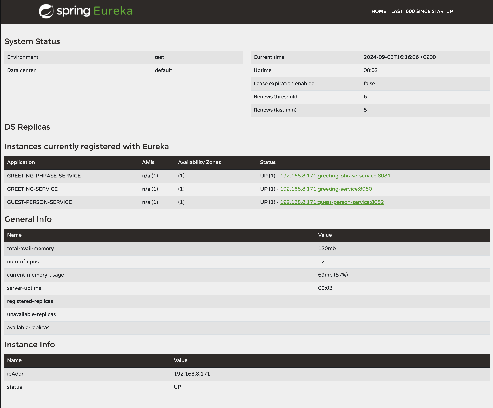
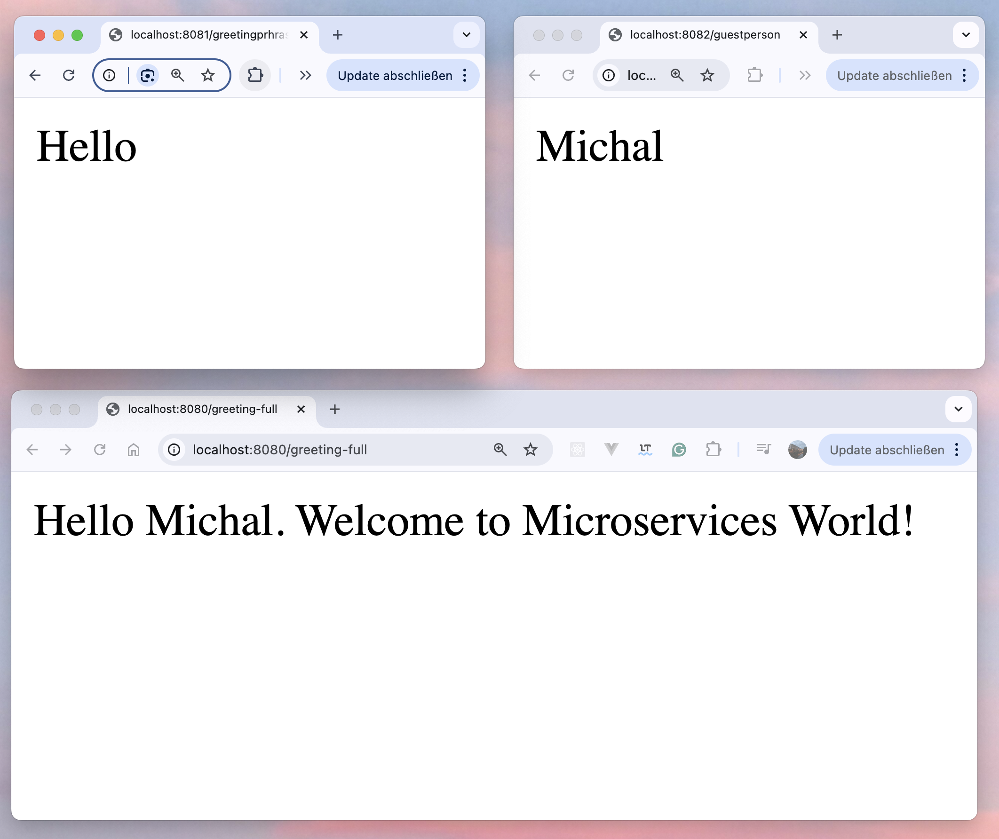
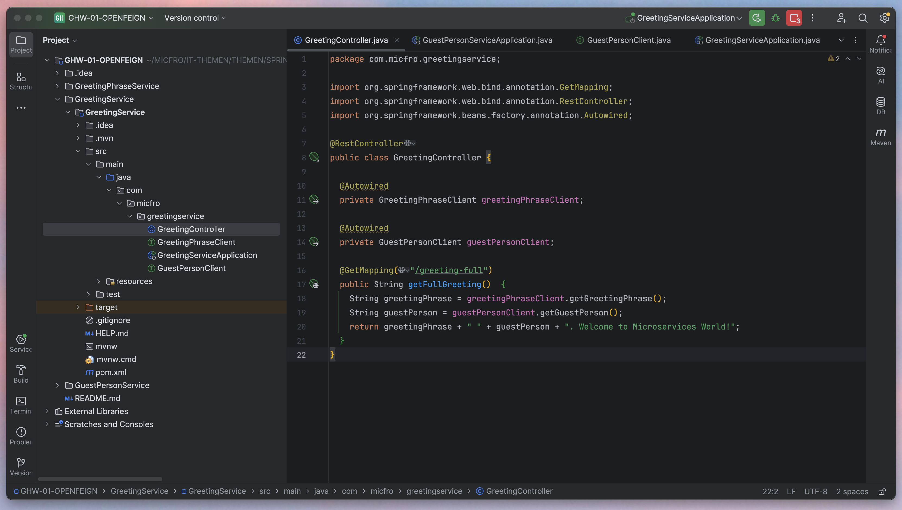

# Spring Boot Microservices - Hello World Application

This project is a simple example of a microservices architecture using Spring Boot and Spring Cloud. The application consists of three microservices:

- **GreetingPhraseService** – provides the phrase "Hello".
- **GuestPersonService** – provides the word "World".
- **GreetingService** – integrates both services to display the combined result, "Hello World".

The services communicate with each other using **Eureka** for service discovery, and **Feign** as a client-side HTTP request generator.


## Technologies Used

- **Java 17**: The programming language used to build the services.
- **Spring Boot**: A framework that simplifies the development of Java applications.
   - **Spring Web**: To create RESTful APIs.
   - **Spring Cloud**: To implement microservices architecture.
- **Spring Cloud Netflix Eureka**: For service discovery, allowing services to register themselves and discover other services dynamically.
- **Spring Cloud OpenFeign**: For simplifying HTTP requests between microservices.
- **Maven**: Build and dependency management tool.

## Architecture

The application follows a simple microservices architecture:

1. **Eureka Server**: Acts as a registry where all services register and discover each other.
2. **GreetingPhraseService**: Provides the greeting phrase "Hello".
3. **GuestPersonService**: Provides the guest name "World".
4. **GreetingService**: Fetches data from the two above services and returns "Hello World".

Each service is a standalone Spring Boot application that communicates with others through Eureka and Feign.

## Installation and Setup

### Steps to Install

1. Clone the repository:
   ```bash
   git clone https://github.com/your-username/microservices-hello-world.git
   cd microservices-hello-world
   ```

2. Build the project using Maven:
   ```bash
   mvn clean install
   ```

3. Navigate to each service directory (`eureka-server`, `greeting-phrase-service`, `guest-person-service`, `greeting-service`) and run the application using Maven:
   ```bash
   mvn spring-boot:run
   ```

### Service Setup

Each service has its own configuration file (`application.yml`) and runs on different ports:

- **Eureka Server**: `http://localhost:8761`
- **GreetingPhraseService**: `http://localhost:8081`
- **GuestPersonService**: `http://localhost:8082`
- **GreetingService**: `http://localhost:8080`

## Running the Services

1. **Run Eureka Server**: First, start the Eureka Server on port `8761`. It acts as a registry for all other services.
   ```bash
   cd eureka-server
   mvn spring-boot:run
   ```

2. **Run GreetingPhraseService**:
   ```bash
   cd ../greeting-phrase-service
   mvn spring-boot:run
   ```

3. **Run GuestPersonService**:
   ```bash
   cd ../guest-person-service
   mvn spring-boot:run
   ```

4. **Run GreetingService**:
   ```bash
   cd ../greeting-service
   mvn spring-boot:run
   ```

Now, the services should be running and discoverable via Eureka at `http://localhost:8761`.

## API Endpoints

### GreetingPhraseService

- **GET** `/greetingphrase`
   - Returns the phrase "Hello".
   - Example: `http://localhost:8081/greeting`

### GuestPersonService

- **GET** `/guestperson`
   - Returns the name "World".
   - Example: `http://localhost:8082/guest`

### GreetingService

- **GET** `/greeting-full`
   - Combines the responses from GreetingPhraseService and GuestPersonService to return "Hello World".
   - Example: `http://localhost:8080/greeting-full`


### Autor
Created by Michal Frost

### Screenshots







